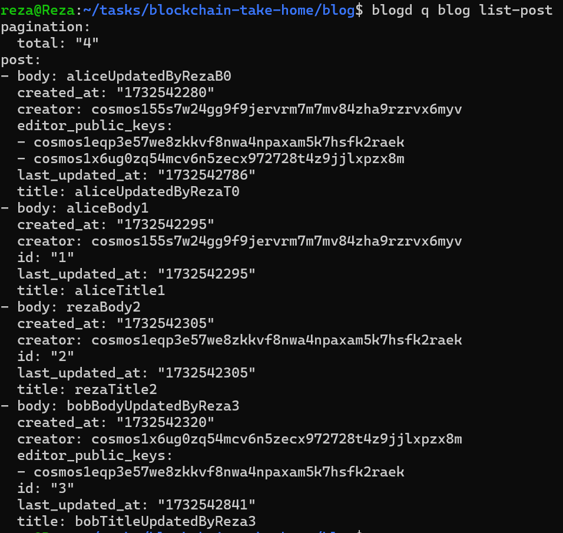

# blockchain-take-home
### Create 4 posts:
```shell
blogd tx blog create-post aliceTitle0 aliceBody0 $(blogd keys show reza -a),$(blogd keys show bob -a) --from alice -y --chain-id blog
blogd tx blog create-post aliceTitle1 aliceBody1 --from alice -y --chain-id blog
blogd tx blog create-post rezaTitle2 rezaBody2 --from reza -y --chain-id blog
blogd tx blog create-post bobTitle3 bobBody3 $(blogd keys show reza -a) --from bob -y --chain-id blog
```


----------------------
### Update 4 posts ( ❌ Third one is not allowed to update ):

```shell
  blogd tx blog update-post "aliceUpdatedT0" "aliceUpdatedB0" 0 --from alice -y --chain-id blog    
  blogd tx blog update-post "aliceUpdatedByRezaT0" "aliceUpdatedByRezaB0" 0 --from reza -y  --chain-id blog   
  blogd tx blog update-post "bobTitleUpdatedByBob3" "bobBodyUpdatedByBob3" 3 --from alice -y  --chain-id blog       
  blogd tx blog update-post "bobTitleUpdatedByReza3" "bobBodyUpdatedByReza3" 3 --from reza  -y --chain-id blog   
```




----------------------
### Delete 2 posts ( ❌ First one is not allowed to delete ):

```shell
  blogd tx blog delete-post 3 --from alice  -y --chain-id blog  
  blogd tx blog delete-post 3 --from reza  -y --chain-id blog  
```


---------------
### Run the following commands to generate proto files and lint them:

```bash
make proto-gen
make proto-lint
```
blog/scripts/protocgen.sh


--------------
## Tasks

1. The blog module does not show up in `blogd query` and `blogd tx` commands. Wire the blog module into the app so that it can be queried and transactions can be made.
    - [x] Add the blog module to the `app/app.go` file.
    - [x] Add the blog module to the `app/app_config.go` file.

2. Whenever we create a new blog post, it overwrites an existing post. Fix this issue so that we can create multiple posts.
   - [x] Add the `k.SetPostCount(ctx, count+1)` function in `blog/x/blog/keeper/post.go`.

3. Updating a post doesn't work as expected. Figure out why and fix it.
   - [x] Remove the `PoslKey = "Posl/value/"`  in `key.go` file.

4. Add a `created_at` and `last_updated_at` timestamp field to the blog post type, and update it with the current block time accordingly whenever a post is created or updated.
    - [x] Add the `CreatedAt` and `LastUpdatedAt` fields to the `Post` struct in `blog/proto/blog/blog/post.proto`.
    - [x] Update the `CreatePost` and `UpdatePost` functions.
    - [x] Generate proto files again.

5. Bonus: Implement a grant authorization mechanism where a post creator can allow other addresses to update or delete their post (e.g. Bob can update and delete Alice's blog posts).
    - [x] Add the `editor_public_keys` fields to the `Post` struct in `blog/proto/blog/blog/post.proto`.
    - [x] Update the `CreatePost` and `UpdatePost` and `DeletePost` functions.
    - [x] `autocli.go` file updated to accept multiple public keys for `editor_public_keys`.
    - [x] in `config.yml` Reza user added to the `genesis` section.
    - [x] in `color.go` for better visibility in stdout, added color to the output.
    - [x] Generate proto files again.


-------------------
## 📝 Todo List

#### Development Tasks
-   [ ] Implement unit tests with proper coverage
-   [ ] Add end-to-end (e2e) tests and use [SimApp](https://docs.cosmos.network/v0.52/learn/advanced/simulation)
-   [ ] Set up Docker or Kubernetes containerization
-   [ ] Configure GitHub Actions for CI/CD
-   [ ] Implement git hooks
-   [ ] Add comprehensive logging system ( [Telemetry](https://docs.cosmos.network/main/learn/advanced/telemetry) )
-   [ ] Implement event publishing mechanism ( [ctx.EventManager().EmitEvent](https://docs.cosmos.network/main/learn/advanced/events) )


#### Security Tasks
- [ ] Conduct a thorough security audit of the codebase
- [ ] Implement proper input validation and sanitization
- [ ] Implement proper error handling


-------
A simple blockchain application that allows users to create, update, and delete blog posts. Only contains one custom x/ module, `blog`.

## Getting started

Starting from the `blog` directory:

1. Install the chain binary with `make install`
2. Initialize the genesis files with `make init`
3. Start the chain with `blogd start --minimum-gas-prices=0stake`


## Useful commands

- `rm -rf ~/blog/` - Remove the chain data

### Transactions

- `blogd tx blog create-post hello world --from alice --chain-id blog` - Create a new post
- `blogd tx blog update-post "Hello" "Cosmos" 0 --from alice --chain-id blog` - Update a post
- `blogd tx blog delete-post 0 --from alice  --chain-id blog` - Delete a post

## Queries

- `blogd q blog show-post 0` - Show a post
- `blogd q blog list-post` - List all posts
